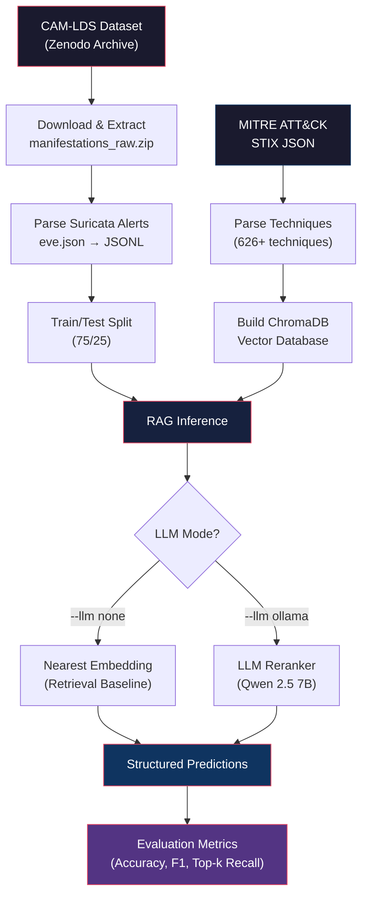

# System Architecture

## Pipeline Overview

## Component Details

### 1. Data Ingestion (`src/download_camlds.py`, `src/prepare_dataset.py`)

The pipeline recursively searches the CAM-LDS raw manifestations archive for `eve.json` files. Only Suricata alert events (`event_type: "alert"`) are retained. Each alert extracts:

- Signature, category, severity
- Protocol and application protocol
- Source/destination ports
- HTTP, DNS, TLS, file, and flow metadata
- Ground-truth MITRE technique ID from the directory path

### 2. MITRE ATT&CK Knowledge Base (`src/build_mitre_kb.py`)

Downloads the official MITRE ATT&CK Enterprise STIX JSON and parses all non-revoked, non-deprecated `attack-pattern` objects into technique documents containing:

- Technique ID, name, tactics, platforms
- Data sources, detection guidance, description
- Official MITRE URL

### 3. Vector Database (`src/build_vector_db.py`)

Encodes technique documents using `sentence-transformers/all-MiniLM-L6-v2` and indexes them in ChromaDB for fast cosine similarity search.

### 4. RAG Inference (`src/predict_rag.py`)

For each alert:
1. Encode alert text with the same SentenceTransformer
2. Query ChromaDB for top-k most similar MITRE techniques
3. Either return the nearest candidate (retrieval baseline) or pass candidates to a local Ollama LLM for reasoning

### 5. Evaluation (`src/evaluate.py`)

Computes standard ML metrics against CAM-LDS ground-truth labels:
- Top-1 accuracy, macro/weighted precision, recall, F1
- Top-k recall (did the correct technique appear in retrieved candidates?)
- Confusion matrix and per-class classification report

### 6. QLoRA Fine-Tuning (`camlds_qwen_qlora_colab_balanced.ipynb`)

Google Colab notebook for fine-tuning Qwen 2.5 with QLoRA on the alert→technique mapping task using balanced class sampling.
